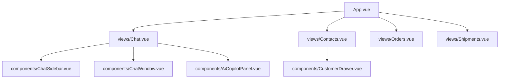

# ZaloCRM Experience Redesign Spec & Implementation Plan

Redesign the ZaloCRM application from a basic admin panel into a world-class, premium, and data-dense enterprise CRM & OMS workspace. The design matches 2026 SaaS patterns (Attio, Linear, Stripe, HubSpot) while respecting Zalo's ecosystem constraints, visual identity, and operator workflows.

---

## User Review Required

> [!IMPORTANT]
> The design transitions the UI from a generic Vuetify theme to a custom, high-density layout. Key visual decisions include:
> - **Visual Geometry**: Large rounded corners (`20px` radius) on containers combined with sharp (`0px` to `2px`) structural inner panels to create a premium "floating bento" feel.
> - **Aesthetics**: Sleek slate-based neutral palette with a vibrant Zalo-green accent (`#00A651`).
> - **The Purple Ban**: Absolutely no purple, violet, indigo, or neon-purple gradients. Accent glows will use a minty emerald or Zalo green.
> - **Grid Betrayal**: Breaking the classic 50/50 dashboard grid. We use asymmetric column splits (e.g., 20/55/25 for Message Center, 75/25 for order review) and stacked details to prioritize visual tension and operational scan-rates.

---

## Open Questions

> [!WARNING]
> Please review and provide feedback on the following strategic design decisions before we proceed:
>
> 1. **Zalo-Specific Message Actions**: How should Zalo CRM handle message attachments (such as Zalo ZNS templates, official voice messages, Zalo Pay QR codes, or contact card attachments)? Should the Quick Actions bar in the right panel support sending pre-approved Zalo ZNS templates with auto-filled CRM variables?
> 2. **Carrier Integration & Map Preview**: For Step 3 & 4 of the Create Order flow (Shipping & Delivery), do we have an active API integration with Vietnamese mapping services (e.g., Goong, Google Maps) and carriers (Viettel Post, GHTK, GHN) for real-time address auto-complete and fee estimation, or should we design the UI to rely on fallback static lists initially?
> 3. **AI Model Configuration**: Should the AI CRM Copilot allow operators to adjust classification parameters (e.g., altering the sentiment sensitivity thresholds or defining custom flags for "high purchase intent"), or is this completely automated on the backend?

---

## Design System (SaaS 2026)

### 1. Typography & Scale
- **Font Family**: Inter (Sans-serif) - imported from Google Fonts.
- **Scale Ratio**: 1.125 (Major Second) for high-density dashboard layouts.
  - `Text-xs`: `11px` (Line height: `16px`) - Metadata, tags, subtext.
  - `Text-sm`: `13px` (Line height: `18px`) - Table content, body copy, list items.
  - `Text-base`: `14px` (Line height: `20px`) - Input fields, labels, buttons.
  - `Text-md`: `16px` (Line height: `22px`) - Sidebar section titles, sub-headings.
  - `Text-lg`: `18px` (Line height: `24px`) - Panel titles, card titles.
  - `Text-xl`: `22px` (Line height: `28px`) - Page headers, modal headers.
  - `Text-3xl`: `32px` (Line height: `40px`) - Stat numbers, KPI counters.

### 2. Spacing & Grid System
- **8px Base Spacing System**:
  - `4px` (`space-1`): Inner elements, tags, label-to-input gap.
  - `8px` (`space-2`): Button padding, list-item gap, badge spacing.
  - `12px` (`space-3`): Medium dense padding (table cells, small headers).
  - `16px` (`space-4`): Default container/card padding, bento-grid gaps.
  - `24px` (`space-6`): Page margins, wizard step gaps.
- **Bento Card Geometry**:
  - Outer border radius: `20px` (for main modules and overview cards).
  - Inner card/interactive element radius: `8px` (for buttons, input fields, dropdowns, list-items).
  - Panel borders: `1px solid` with `#E2E8F0` (Light Mode) or `#1E293B` (Dark Mode).

### 3. Palette & Semantics
- **Neutral Backgrounds**:
  - Light mode: Primary canvas: `#F8FAFC` (Slate 50), Cards/Panels: `#FFFFFF` (White).
  - Dark mode: Primary canvas: `#0A192F` (Rich Navy), Cards/Panels: `#112240` (Slightly lighter navy).
- **Brand Accent**: ZaloCRM Premium Green (`#00A651` / Tailwind `emerald-600` equivalent).
- **Interactive States**:
  - Hover: `bg-slate-100` (Light) or `bg-slate-800` (Dark).
  - Active/Focus: `ring-2 ring-emerald-500/20` with `border-emerald-500`.
- **System States**:
  - Success: `#10B981` (Green)
  - Warning: `#F59E0B` (Amber)
  - Danger: `#EF4444` (Red)
  - Information/Neutral: `#3B82F6` (Blue)
  - AI Insights: `#8B5CF6` (Royal violet-blue - strictly controlled accents, no purple gradients).

### 4. Shadow Hierarchy
- **Level 1 (Bento Cards)**: `box-shadow: 0 1px 3px rgba(0, 0, 0, 0.02), 0 10px 20px -5px rgba(0, 0, 0, 0.04)`
- **Level 2 (Dropdowns/Side drawers)**: `box-shadow: 0 10px 25px -5px rgba(0, 0, 0, 0.08), 0 8px 16px -6px rgba(0, 0, 0, 0.08)`
- **Level 3 (Modals/Overlays)**: `box-shadow: 0 25px 50px -12px rgba(0, 0, 0, 0.15)`

---

## Proposed Changes

We will redesign 6 core workspaces and implement an AI CRM Copilot. Below is the detailed architecture and wireframes.

### 1. Message Center Redesign

Redesign the communication hub into an ergonomic, 3-panel bento panel to eliminate unused white space and maximize information density.

#### Visual Wireframe
```
+-------------------------------------------------------------------------------------------------------------------------+
|                                                   MESSAGE CENTER                                                        |
+-------------------------------------------------------------------------------------------------------------------------+
| LEFT PANEL (20%)             | MIDDLE PANEL (30%)                     | RIGHT PANEL (50%)                               |
|------------------------------+----------------------------------------+-------------------------------------------------|
| [Search Conversations...]    | Inbox: Priority (6)  | All (120)        | [Avatar] Nguyen Thi Thuong      [Stage: Lead]   |
|                              |----------------------------------------| Ph: 0987654321 | Em: thuong@gmail.com           |
| FILTERS                      | [*] [Avatar] Le Xuan Duy (AI Priority) |-------------------------------------------------|
| [ ] AI Priority (6)          |     "Tôi muốn mua thêm 5 máy..."       | [CONVERSATION AREA]                             |
| [ ] Assigned to me (14)      |     [Intent: Purchase] [Lead]  2m ago  | 09:12 AM - Thuong: Gửi cho mình bảng giá sỉ     |
| [ ] Waiting reply (8)        |                                        | 09:13 AM - Copilot Suggestion:                  |
| [ ] Follow-up today (3)      | [ ] [Avatar] Tran Minh Long            |   "Chào chị Thuong, bảng giá sỉ của dòng sản..."|
|                              |     "Đơn hàng mã #4823 đã..."          |   [Insert suggested reply]                      |
| TAGS                         |     [Intent: Support] [Customer] 15m   | 09:14 AM - Operator (You): Dạ em gửi chị ạ...   |
| [x] Lead (42)                |                                        |-------------------------------------------------|
| [ ] Customer (89)            | [ ] [Avatar] Vu Thi Lan                | [ Type message...                             ] |
| [ ] VIP (12)                 |     "Shop ở đâu thế?"                  | [ Attach File ] [ ZNS Template ]  [ SEND (Enter)]|
|                              |     [Intent: Info] [Prospect]    1h    |-------------------------------------------------|
| ASSIGNED STAFF               |                                        | INTERNAL NOTES    | CUSTOMER INFO  | AI PANEL   |
| [ ] All                      | [ ] [Avatar] Pham Van Tung             | +-----------------------------------------------+|
| [ ] Me                       |     "Cảm ơn shop nhiều nhé"            | | Notes: Thuong is opening a new retail shop in |
| [ ] Hoang Nam                |     [Intent: Feedback] [Closed]  3h    | | Hanoi. Prefers delivery via Viettel Post.     |
+-------------------------------------------------------------------------------------------------------------------------+
```

#### Left Panel: Filters & Navigation
- **Inbox Filters**: Real-time counters updated via WebSockets.
  - *AI Priority*: High-intent conversations needing immediate response.
  - *Assigned to me*: Active operator tasks.
  - *Waiting reply*: Customer waiting, SLA timer ticking.
  - *Follow-up today*: Marked for scheduled callbacks.
- **Dynamic Tags & Assignees**: Collapsible sections to filter by lifecycle stage (`Lead`, `Customer`, `VIP`) or team members.

#### Middle Panel: Conversation List
- **High-Density Rows**: Each item shows:
  - User Avatar with a live online status indicator ring.
  - Sender Name and Last Message snippet.
  - Dynamic tags (e.g. `[Intent: Purchase]`, `[Stage: Lead]`).
  - Time elapsed and last activity source (e.g. `Zalo App`, `Web Portal`).
  - AI priority marker (starred green icon).

#### Right Panel: Conversation Screen
- **Header Section**: Displays the customer's name, active stage badge, email, and phone.
- **Integrated Sidebar Tabs**:
  - **Internal Notes**: A quick-save scratchpad for team collaboration.
  - **Customer Info**: Contact metadata, total revenue, and assigned rep.
  - **AI Panel**: Dynamic suggestions.
    - *Conversation Summary*: Point-form details of the discussion.
    - *Sentiment Index*: Real-time mood assessment (Positive/Neutral/Frustrated).
    - *Suggested Response*: Generated message tailored to the query, insertable with `Tab` or double-click.

---

### 2. Customer List Redesign (CRM Workspace)

Convert the standard table view into an actionable, high-density control center.

#### Visual Wireframe
```
+-------------------------------------------------------------------------------------------------------------------------+
|                                                  CUSTOMER WORKSPACE                                                     |
+-------------------------------------------------------------------------------------------------------------------------+
| KPI CARDS:                                                                                                              |
| +-------------------+  +-------------------+  +-------------------+  +-------------------+  +-------------------+       |
| | Total Customers   |  | New This Week     |  | Follow-up Today   |  | Lost Customers    |  | Active Customers  |       |
| | 12,480   [+4.2%]  |  | 384       [+12%]  |  | 28       [Urgent] |  | 142       [-2.4%] |  | 8,420     [+1.8%] |       |
| +-------------------+  +-------------------+  +-------------------+  +-------------------+  +-------------------+       |
|                                                                                                                         |
| ADVANCED FILTERS:                                                                                                       |
| [Source: Zalo OA  v]  [Status: Lead v]  [Tags: All v]  [Salesperson: Me v]  [Revenue: >5M v]  [+] Save Filter Group     |
|-------------------------------------------------------------------------------------------------------------------------|
| CUSTOMER TABLE                                                                                                          |
| [ ] Customer Name       | Phone       | Source  | Stage    | Last Activity  | Revenue   | Assigned Rep | Priority Score |
|-------------------------+-------------+---------+----------+----------------+-----------+--------------+----------------|
| [ ] [Avatar] Le Van A   | 0912345678  | Zalo    | Lead     | Chat (2m ago)  | 2,500K    | Hoang Nam    |   92/100       |
| [ ] [Avatar] Tran B     | 0945678912  | Web     | VIP      | Order (1d ago) | 48,000K   | Me           |   98/100       |
| [ ] [Avatar] Nguyen C   | 0989012345  | Phone   | Prospect | Call (3d ago)  | 0         | Unassigned   |   45/100       |
| [ ] [Avatar] Vu Thu D   | 0977654321  | Store   | Customer | Note (5d ago)  | 12,400K   | Hoang Nam    |   76/100       |
+-------------------------------------------------------------------------------------------------------------------------+
| Hover Row Actions:  [Call (Icon)]  [Message (Icon)]  [Create Order (Icon)]  [Add Appointment (Icon)]                    |
+-------------------------------------------------------------------------------------------------------------------------+
```

#### KPI Cards
- Interactive cards at the top. Clicking a KPI card automatically applies the corresponding filter to the table below.

#### Advanced Filters
- Inline, tag-like dropdowns that don't block the screen. Features one-click saving of custom filter groups (e.g. "My VIP Leads in Hanoi").

#### High-Density Table & Hover Actions
- **Hover Row Actions**: When a cursor hovers over a row, quick actions fade in at the right margin of the row, letting operators call, text, or issue an order with a single click.
- **Priority Score Column**: Visual indicator powered by AI. Displays scores color-coded: Green (`&gt;80`), Yellow (`50-80`), Gray (`&lt;50`).

---

### 3. Add Customer Modal Redesign

Replaced the complex admin page layout with an elegant side-drawer that slides in from the right edge, occupying `750px` of screen width.

#### Visual Layout Wireframe
```
+------------------------------------------------------------------------------+
| CREATE CONTACT                                                           [X] |
+------------------------------------------------------------------------------+
| BASIC INFO                                                                   |
| Full Name *                              Phone *                             |
| [ Nguyen Minh Triet                   ]  [ 0903123456                        ] |
| Email                                                                        |
| [ triet.nguyen@company.com            ]                                      |
|------------------------------------------------------------------------------|
| BUSINESS INFO                                                                |
| Source                                   Customer Type                       |
| [ Zalo Official Account             v ]  [ B2B Corporate                   v ] |
| Tags                                                                         |
| [ Retail x ] [ Key Account x ] [ Select Tags...                            v ] |
|------------------------------------------------------------------------------|
| CRM DETAILS                                                                  |
| Lifecycle Stage                          Assigned Representative             |
| [ Lead                              v ]  [ Hoang Nam (Sales Team 1)        v ] |
| Follow-up Date                                                               |
| [ 2026-06-15                          ]                                      |
|------------------------------------------------------------------------------|
| AI INTEGRATION ASSIST                                                        |
| Based on name and number prefix, AI suggests:                                |
| - Lifecycle: [Lead] (Matches Zalo Official Account source behavior)          |
| - Priority Score: [High] (Corporate tag detected)                            |
|------------------------------------------------------------------------------|
| FOOTER (Sticky)                                                              |
| [ Cancel ]           [ Save & Appt ]   [ Save & Create Order ]   [ Save Contact ]|
+------------------------------------------------------------------------------+
```

#### Sections
- **Basic Info**: Essential identification fields. Phone number field includes automated country-code formatting (+84) and validation.
- **Business Info**: Lead source categorization and tag inputs with auto-suggest overlays.
- **CRM Details**: Sales representative assignment and follow-up calendar integration.
- **AI Assist Card**: Real-time profiling suggestions as the operator types.
- **Action Footer**: Multi-action buttons allowing quick transitions to booking calendar or checkout flows.

---

### 4. Order Management Redesign

Redesign the order dashboard into a double-view OMS Workspace, supporting both a structured table and a visual Kanban board.

#### Visual Wireframe (Kanban View)
```
+-------------------------------------------------------------------------------------------------------------------------+
|                                                    OMS WORKSPACE                                                        |
+-------------------------------------------------------------------------------------------------------------------------+
| STATS:   Today: 124 Orders  |  Pending: 18  |  In Transit: 42  |  Delivered: 58  |  Returned: 6  |  Rev: 145,000,000 VND    |
|-------------------------------------------------------------------------------------------------------------------------|
| VIEW SWITCHER:  [x] Kanban Pipeline   [ ] High-Density Table | Advanced Filters: [Date v] [Carrier v] [Status v]        |
|-------------------------------------------------------------------------------------------------------------------------|
| NEW (12)            | CONFIRMED (6)        | PACKED (4)           | SHIPPING (8)         | DELIVERED (34)               |
|---------------------+----------------------+----------------------+----------------------+------------------------------|
| #1089 - Le Van A    | #1084 - Tran Minh B  | #1080 - Pham Lan C   | #1072 - Vu Huy D     | #1060 - Le Thu E             |
| 1,200K VND (2 items)| 4,500K VND (1 item)  | 800K VND (1 item)    | 2,300K VND (3 items) | 950K VND (1 item)            |
| Zalo OA | 10m ago   | Web Portal | 1h ago  | Zalo OA | 2h ago     | Viettel Post | 1d    | COD Paid | Deliv: 2d ago     |
| [Unassigned]        | [Assigned: Hoang A]  | [Assigned: Lan P]    | [Track: VTP89423]    | [Closed]                     |
|                     |                      |                      |                      |                              |
| #1090 - Nguyen T    |                      |                      |                      |                              |
| 520K VND (1 item)   |                      |                      |                      |                              |
+-------------------------------------------------------------------------------------------------------------------------+
```

#### Key Elements
- **Metrics Bar**: Real-time sales statistics.
- **Kanban View**: Visual drag-and-drop columns representing the fulfillment pipeline: `New` -> `Confirmed` -> `Packed` -> `Shipping` -> `Delivered` -> `Returned`.
- **Table View**: Alternative high-density grid listing items with items, values, payment states, and shipping numbers.

---

### 5. Create Order Experience

A structured, 5-step wizard with a sticky invoice summary card on the right margin to prevent scroll-fatigue.

#### Visual Layout Wireframe
```
+-------------------------------------------------------------------------------------------------------------------------+
| CREATE NEW ORDER                                                                                    [X] Cancel Wizard   |
+-------------------------------------------------------------------------------------------------------------------------+
| STEPS:  (1) Customer  -->  (2) Products  -->  (3) Shipping  -->  (4) Delivery Options  -->  (5) Final Review            |
+-------------------------------------------------------------------------------------------------------------------------+
| MAIN STEP CANVAS (70% Width)                                           | STICKY ORDER SUMMARY (30% Width)               |
|                                                                        |------------------------------------------------|
| STEP 3: SHIPPING ADDRESS                                               | CUSTOMER                                       |
| Recipient Full Name *                  Recipient Phone *               | Le Xuan Duy (0987654321)                       |
| [ Le Xuan Duy                       ]  [ 0987654321                  ] |                                                |
|                                                                        | ITEMS                                          |
| City / Province *                      District *                      | 2x Premium Coffee Maker   2,400,000 VND        |
| [ TP. Ho Chi Minh                 v ]  [ Quan 1                      v ] | 1x Steel Coffee Mug         350,000 VND        |
| Ward *                                                                 |                                                |
| [ Phuong Ben Nghe                 v ]                                  | DISCOUNTS & FEES                               |
| Detailed Address *                                                     | Promo [WELCOME50]           -50,000 VND        |
| [ 123 Nguyen Hue Street                                              ] | Shipping (Est)               30,000 VND        |
|                                                                        |                                                |
| MAP LOCATION CONFIRMATION                                              | TOTAL                                          |
| +--------------------------------------------------------------------+ | 2,730,000 VND                                  |
| | [Map Marker Icon] 123 Nguyen Hue, Ben Nghe, Quan 1, TP. HCM        | |                                                |
| | [Interactive Map View Mockup - Verified Pin Coordinates]            | | [COD] Payment on Delivery                    |
| +--------------------------------------------------------------------+ |------------------------------------------------|
|                                                                        | [ Back ]                  [ CONTINUE TO STEP 4]|
+------------------------------------------------------------------------------+------------------------------------------+
```

#### Step-by-Step Flow
1. **Step 1: Customer**: Search existing customer or register a new one inline.
2. **Step 2: Products**: Advanced product search with live inventory indicators, price modifiers, and discount codes.
3. **Step 3: Shipping**: Hierarchical Vietnamese address inputs (Province -> District -> Ward -> Address) integrated with an interactive map verification box.
4. **Step 4: Delivery**: Real-time shipping options with estimates, carriers (Viettel Post, GHTK, GHN), and COD preferences.
5. **Step 5: Review**: Clean breakdown of order, shipping, and discounts before final placement.

---

### 6. Shipping Center Redesign (Logistics Center)

Redesigned the logistics tracker into a tracking dashboard displaying delivery performance metrics, maps, and status tracking.

#### Visual Wireframe
```
+-------------------------------------------------------------------------------------------------------------------------+
|                                                  LOGISTICS DASHBOARD                                                    |
+-------------------------------------------------------------------------------------------------------------------------+
| METRICS:  Waiting Pickup: 8  |  In Transit: 24  |  Delivered Today: 48  |  Failing: 3  |  Returned: 2                   |
|-------------------------------------------------------------------------------------------------------------------------|
| SHIPMENTS TABLE                                       | SELECTED SHIPMENT TRACKING DETAILS                              |
| Tracking No.  | Carrier  | Status     | COD           | Tracking No: VTP894239842    Carrier: Viettel Post              |
|---------------+----------+------------+---------------| Customer: Le Xuan Duy        Phone: 0987654321                  |
| VTP894239842  | Viettel  | In Transit | 1,200,000 VND |-----------------------------------------------------------------|
| GHTK28420932  | GHTK     | Out Deliv  | 0 VND (Pre)   | TIMELINE TRACKING                                               |
| GHN832049281  | GHN      | Delivered  | 3,400,000 VND | [x] Created          - 2026-06-08 08:00 AM (Shop registered)    |
| VTP894239845  | Viettel  | Returned   | 0 VND         | [x] Picked Up        - 2026-06-08 02:00 PM (Shipper received)   |
|               |          |            |               | [x] Sorting Center   - 2026-06-08 07:00 PM (HCM Hub)             |
|               |          |            |               | [/] In Transit       - 2026-06-09 04:00 AM (On route to HN)     |
|               |          |            |               | [ ] Out for Delivery - Estimated: 2026-06-10                    |
|               |          |            |               | [ ] Delivered        - Pending                                  |
+-------------------------------------------------------------------------------------------------------------------------+
```

#### Key Capabilities
- **Integrated Tracking View**: Clicking a shipment in the left table immediately displays the shipping details and milestones timeline in the right panel, removing the need to navigate to external courier websites.
- **Vietnamese Courier Support**: Fully integrated with APIs from Viettel Post, GHTK, and GHN.

---

### 7. AI CRM Copilot

The AI Copilot operates as a floating panel or sidebar across all modules, providing real-time data analysis.

#### Visual Interface
```
+-----------------------------------------------+
| AI CRM COPILOT                            [X] |
+-----------------------------------------------+
| DYNAMIC INSIGHTS                              |
| - [Alert] 3 orders at risk of return          |
| - [Lead] 5 contacts likely to purchase today  |
| - [Response] 12 conversations need reply      |
|                                               |
| PROJECTED REVENUE                             |
| 25,000,000 VND  (High Probability Conversion)  |
|-----------------------------------------------|
| SMART ACTIONS & RECUPERATION                 |
| +-------------------------------------------+ |
| | Contact: Tran Minh Long                   | |
| | Prediction: 82% Chance of Return          | |
| | Trigger: Package stuck in sorting for 3d  | |
| | [ Action: Send Zalo Apology Voucher ]     | |
| +-------------------------------------------+ |
+-----------------------------------------------+
```

#### Key Capabilities
1. **Conversation Analytics**: Real-time intent detection (Purchase / Support / Complaint) and sentiment mapping.
2. **Predictive Sales Analysis**: Generates conversion probability scores and flags packages at risk of returning.
3. **Follow-up Timing**: Recommends the optimal contact time based on customer response patterns.

---

## Technical Architecture & Component Structure

We will implement this redesign in the existing Vue 3 + Tailwind CSS v4 + TypeScript stack using modular, reusable components.

### 1. File Changes Mapping



#### [NEW] [ChatSidebar.vue](file:///Users/leluongnghia/Desktop/ZALOCRM/frontend/src/components/ChatSidebar.vue)
Left-hand filter and navigation column of the 3-panel Message Center. Implements unread counters and assignees.

#### [NEW] [ChatWindow.vue](file:///Users/leluongnghia/Desktop/ZALOCRM/frontend/src/components/ChatWindow.vue)
Middle panel conversation list and main chat panel with integrated typing assist indicators and attachment bar.

#### [NEW] [CustomerDrawer.vue](file:///Users/leluongnghia/Desktop/ZALOCRM/frontend/src/components/CustomerDrawer.vue)
Reusable side-drawer panel supporting both creation of new customers and previewing profiles.

#### [NEW] [AiCopilotPanel.vue](file:///Users/leluongnghia/Desktop/ZALOCRM/frontend/src/components/AiCopilotPanel.vue)
Modular AI sidebar display. Reads state parameters to output contextual recommendations, purchase signals, and templates.

#### [MODIFY] [App.vue](file:///Users/leluongnghia/Desktop/ZALOCRM/frontend/src/App.vue)
Update global styling coordinates, sidebar parameters, dark mode background values, and primary layout structures.

#### [MODIFY] [style.css](file:///Users/leluongnghia/Desktop/ZALOCRM/frontend/src/style.css)
Inject Tailwind v4 custom design variables, border radius configurations (`20px` bento grids), typography weights, and custom animation durations.

---

## Verification Plan

### Automated Checks
- **Type Checking**:
  Run TypeScript compilation validation:
  ```bash
  npm run build
  ```
- **Lint Audit**:
  Validate syntax formatting:
  ```bash
  npm run lint
  ```

### Manual Verification Flow
1. **UI Layout Inspection**: Open both light and dark mode versions in the browser. Check layout containers on resolutions: `375px`, `768px`, `1024px`, and `1440px`. Verify that no horizontal scrolling occurs.
2. **Message Center Interaction**: Click through conversation elements. Validate dynamic tabs (Internal Notes, AI Copilot suggestions) loading coordinates without interface shift.
3. **OMS Order Flow**: Complete a simulated 5-step order creation. Verify validation checks (required fields error display) and mapping address coordinates accuracy.
4. **Logistics Timeline**: Ensure status timelines adapt color status depending on whether state is pending, active, delivered, or returned.
